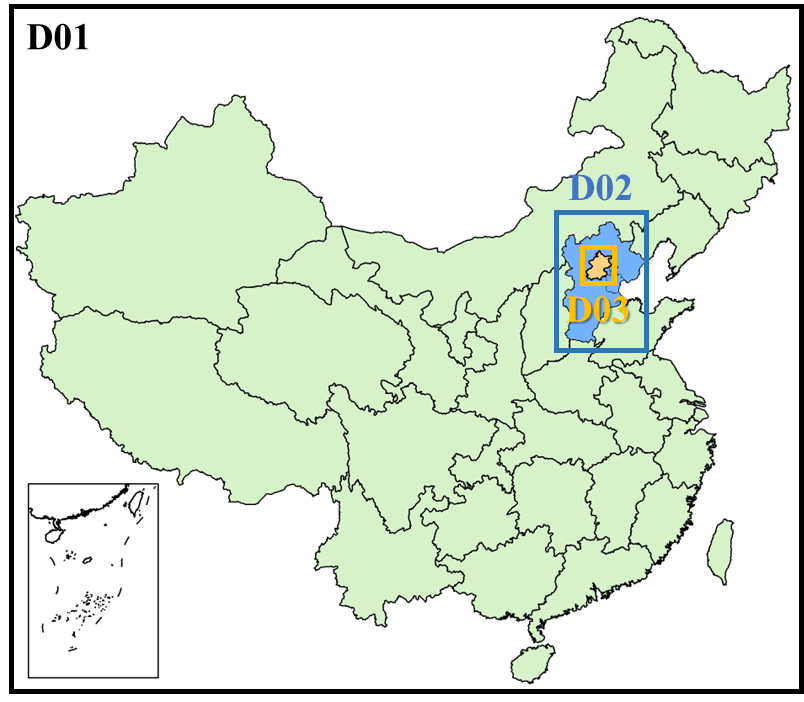
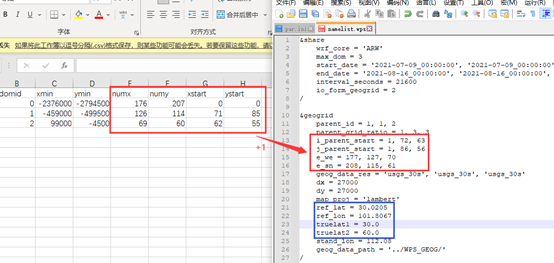
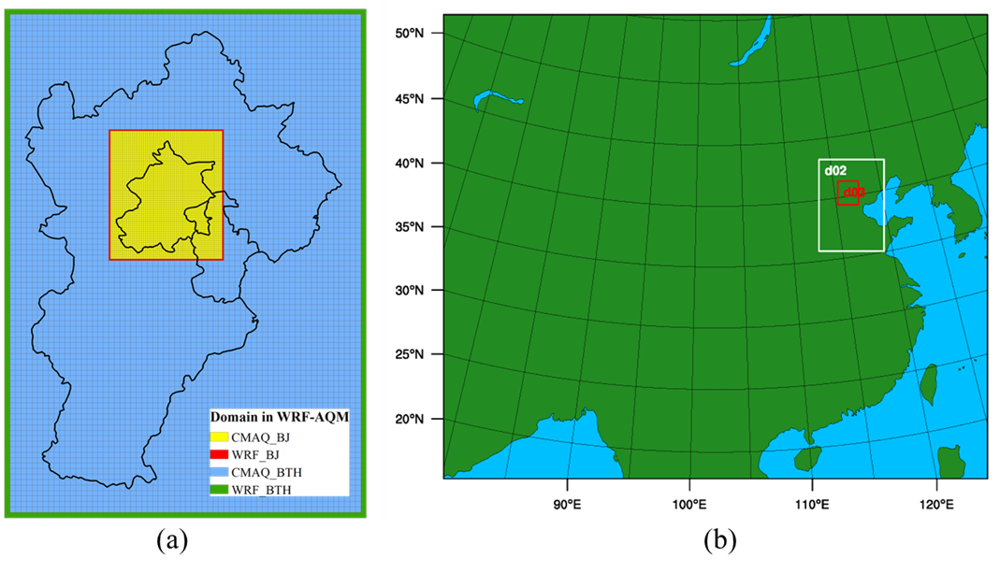
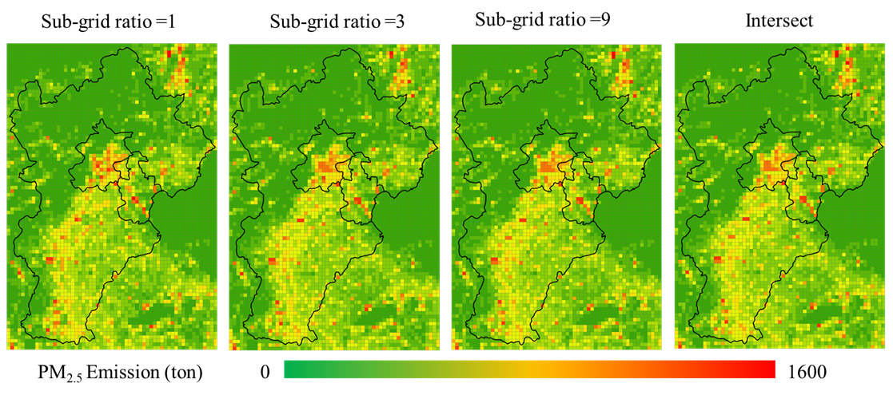

# 手册说明

作为中国的首都，北京人口众多，车辆众多，成为中国空气污染研究的热点。本教程呈现了一个三层嵌套域案例的工作流程：中国大陆、京津冀（BTH）和北京（BJ），空间分辨率分别为27、9和3km，如图所示。



本教程将完成WRF-AQM（CMAQ or CAMx）从设计模拟域到输出能够直接输入AQM的排放清单的所有工作。

# 工具说明

* **prepgrid**

根据shapefile文件绘制模拟嵌套域并绘制模拟网格，输出WRF中`namelist.wps`以及`namelist.input`中的相关参数。

* **downscale**

基于输入排放因子数据库（道路、人口等）降尺度粗分辨率排放清单。

* **mapinv**

将降尺度后的排放清单映射到模拟网格中，此部分输出文件可以提供给prepmodel。

* **prepmodel**

将csv文件转换为可以直接输入到CMAQ模型中的排放清单文件，此过程涉及时间分配和物种分配。

# 开始

本案例运行环境为Windows 10.

## Step 1：绘制模拟嵌套域

此部分采用`prepgrid`进行。

首先进入`prepgrid.exe`可执行程序所在目录，然后配置`par.ini`文件。

```ini
[projection]
# lat in lcc project
lat1:33.0       
lat2:42.0
[domain]
#number of domian
casename:3nestdomain
numdom:3
#shpfile in ecah domain
shpath: ./shp/mainlandchina.shp,./shp/JJJ.shp,./shp/beijing.shp
# grid space in ecah domian
dx:27000,9000,3000
# add grid in each domian,
#xl:left in x direction;xr:right in xdirection;yd:down;yt:top 
# attention the added grid different directoin muse be equal,eg xladd=xradd
#in other domian added grid must be  a multiple of dx_parent/dx_son
xladd:2,3,3
xradd:2,3,3
ytadd:2,3,3
ydadd:2,3,3
domname:china,JJJ,beijing
model_clip:1,1,1
```

`par.ini`参数说明：

--------------------------------------

[projection]

**lat1, lat2:** 标准纬度1 ($true_lat1)和标准纬度2 ($true_lat2)

[domain]

**casename:** 案例名称，影响输出文件命名。

**numdom:** 嵌套层数，本案例中设置3层嵌套，因此设置为3。

**shpath:** 分别为第一层嵌套，第二层嵌套以及第三层嵌套的shapefile文件。

**dx:**分别为第一层嵌套，第二层嵌套以及第三层嵌套的水平分辨率。

**xladd,xradd,ytadd,ydadd:** 该工具会以输入的shapefile文件的范围为基准创建WRF网格，此处四个参数分为为在shapefile文件的最大范围基准上，向左，向右，向上和向下分别增加的网格数量。此处的设置可以解释为，在第一层嵌套四周均增加2个网格，在第二层和第三层的四周均增加3个网格。

**domname:** 分别为第一层嵌套，第二层嵌套以及第三层嵌套的嵌套域名称，影响输出文件命名。

**model_clip:** 创建一个CMAQ网格，此网格在WRF网格的基础上裁剪的网格数量。此处可以解释为CMAQ网格会在原始网格的四周均裁剪掉1个网格，作为CMAQ网格。

-----------------------------

**部分标准纬度的设置方法见下图**：

| 序号 | 适用省区                                  | 第一标准纬度 | 第二标准纬度 | 最大长度形变 |
| :--: | ----------------------------------------- | ------------ | ------------ | ------------ |
|  1   | 黑龙江                                    | 45           | 52.5         | 0.2%         |
|  2   | 吉林、辽宁                                | 40           | 45.5         | 0.2%         |
|  3   | 内蒙古                                    | 39           | 46           | 0.4%         |
|  4   | 河北、山东、山西、陕西、甘肃、宁夏z、青海 | 33           | 42           | 0.3%         |
|  5   | 新疆                                      | 36.5         | 48           | 0.5%         |
|  6   | 湖北、江苏、安徽、河南                    | 30           | 35.5         | 0.1%         |
|  7   | 四川、西藏                                | 27.5         | 35           | 0.2%         |
|  8   | 湖南、浙江、福建、江西、贵州              | 25           | 30.5         | 0.2%         |
|  9   | 云南                                      | 22           | 28.5         | 0.3%         |
|  10  | 广东、广西、台湾                          | 21           | 25.5         | 0.2%         |

配置`par.ini`文件以后，在终端中输入以下命令开始运行。

```shell
./prepgrid.exe
```

如果在屏幕中显示了类似如下命令，则说明运行成功。

```
Prepgrid tool for allocating regional emissions, created  by Kun Wang from IUSE Beijing in 2022.
LCC projection:  mid lon:102.07366854247363,mid lat:36.68731137325006
processing Domain ID:0
getting gridding parameters for Domain:0
creating fishnet for WRF of WRF:0
creating fishnet for AQM of AQM:0
clip x or y direction by 1 grid
processing Domain ID:1
getting gridding parameters for Domain:1
modifying gridnum
no modify gridnum
creating fishnet for WRF of Domain:1
creating fishnet for AQM of Domain:1
clip x or y direction by 1 grid
processing Domain ID:2
getting gridding parameters for Domain:2
no modify gridnum
modifying gridnum
creating fishnet for WRF of Domain:2
creating fishnet for AQM of Domain:2
clip x or y direction by 1 grid
finish
```

此处打印信息中的第二行：`LCC projection:  mid lon:102.07366854247363,mid lat:36.68731137325006`分别为**中心经度**和**中心纬度**。

此外，你可以在`output`目录下面看到系列输出文件：

```
├── 3nestdomain_gridinfo.csv
├── aqmJJJ.csv ---- D02的CMAQ网格信息，将会被用到mapinv中
├── aqm_JJJ.shp
├── aqm_beijing.shp
├── aqm_china.shp 
├── aqmbeijing.csv ---- D03的CMAQ网格信息，将会被用到mapinv中
├── aqmchina.csv ---- D01的CMAQ网格信息，将会被用到mapinv中
├── wrf_JJJ.csv
├── wrf_JJJ.shp
├── wrf_beijing.csv
├── wrf_beijing.shp
├── wrf_china.csv
├── wrf_china.shp
```

其中`aqm*.csv`文件和`wrf_*.csv`文件都是详细的网格信息，其中`aqm*.csv`将会被使用到`mapinv`程序中，此外`*_gridinfo.csv`为WRF的`namelist.wps`中的设置参数，具体的映射关系如图所示。



输出结果的可视化可以直接通过`*.shp`文件来实现，如图所示为此次运行所绘制的网格。



## Step 2：降尺度排放清单

此部分采用`downscale`进行。

首先进入`downscale.exe`可执行程序所在目录，然后配置`par.ini`文件。

```ini
[preinv]
invf:./input/domain/aqmJJJ.csv
dx:9000
ratio:3
casename:3km3
[allocate]
emissions:./regioninv/agricultureannual.csv,./regioninv/transportationannual.csv,./regioninv/residentialannual.csv
method:area,road,pop
```

`par.ini`参数说明：

-------------------------

**invf：**网格信息 **由`prepgrid.exe`输出的网格信息文件。**

**dx：**网格大小

**ratio：**次网格比例（3km以上建议采用3，以下建议采用1）

**casename：**清单名称

**emission：**区域清单文件 **需要通过MEIC清单自行创建，具体的操作方法见[MEIC的区域清单文件创建手册]()。**

**method：**分配方法 **可选择`[area, road, pop]`分别是面积分配、道路分配和人口分配。**

---------------------

配置`par.ini`文件以后，在终端中输入以下命令开始运行。

```shell
./downscale.exe
```

如果程序没有出现报错则说明运行成功。

---------------------------

**以下列出了此过程中可能会出现的报错：**

1. `FileNotFoundError: [Errno 2] No such file or directory: b'./input/Temp/tempMEIC.nc'`

解决办法：将已有的任意MEIC清单的nc格式文件，重命名为`tempMEIC.nc`并移动到`./input/Temp`目录中。

2. `OSError: Cannot save file into a non-existent directory: 'output\sa'`

解决办法：在`output\`目录中手动创建`sa\`目录。

3. `FileNotFoundError: [Errno 2] No such file or directory: b'./input/SA/popchina1km.nc'`

解决办法：将`./input/SA/popchina3km.nc`重命名为`./input/SA/popchina1km.nc`.

--------------------

如图所示是不同`ratio`下的清单分配结果。

