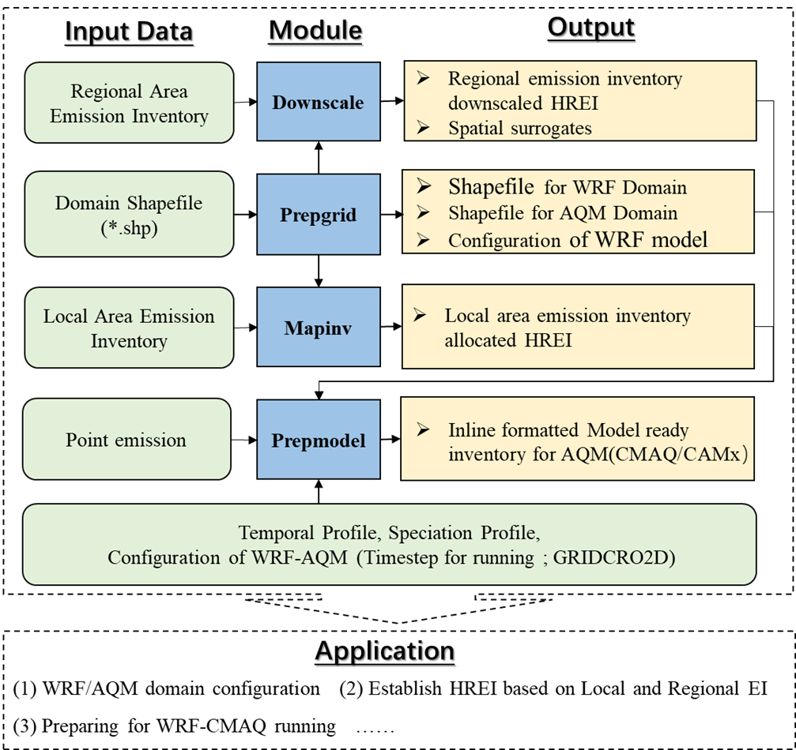

# Inventory Spatial Allocate Tool 

Inventory Spatial Allocate Tool (ISAT) is a tool for spatially assigning emission inventories based on geographic information data such as urban facility points, population, roads, and land use types and this tool implements the following 3 functions.

1. Automatically draw WRF and AQM grid and determining the parameters in  `namelist.wps` and `namelist.input`.
2. Highly efficient emission inventory downscaling tool.
3. Build the emission inventory files which can be entered directly into CMAQ and CAMx model.

**This is the flow chart of this tools. **

## Update Logs

### Dec. 24, 2022:

1. Change the Chinese manual to English manual.

### Dec. 1, 2022：

1. Extend the public use period to December 1, 2023.
2. Add [the offline vertical assignment tools](cmaqprofile).

## User Manual

* [Quick Start](./Doc/Quick_start.md)：Using the MEIC emission inventory as an example, we briefly describe how to quickly use ISAT to design simulation grids, inventory assignments, and build emission inventory files that can be directly imported into CMAQ and CAMx.

## About Us

### **This tools is developed By**：

* ***Kun Wang (wkty@mail.bnu.edu.cn).***

***From Institute of urban safety and environmental science, Beijing academy of science and technology, Beijing 100054, China***

### **Team members**:

* **Chao Gao**

***From Key Laboratory of Wetland Ecology and Environment, Northeast Institute of Geography and Agroecology, Chinese Academy of Science, Changchun, 130102, China.***

* **Haofan Wang**

***From School of Atmospheric Sciences, Sun Yat-sen University, Zhuhai, Guangdong, China.***

* **Kaiyun Liu**

***From State Key Joint Laboratory of Environment Simulation and Pollution Control, School of Environment, Tsinghua University, Beijing 100084, China***

* **Shuhan Liu**

***From Hainan University.***

## Team Achievements

Kun Wang et al. Unit-based emissions and environmental impacts of industrial condensable particulate matter in China in 2020,Chemosphere ,2022.

Kun Wang et al., Identification of NOx hotspots from oversampled TROPOMI NO2 column based on image segmentatio n method, Science of the Total Environment, 2021, 803

Kun Wang et al., Measure -specific environmental benefits of air pollution control for coal-fired industrial boilers in China from 2015 to 2017, Environmental Pollution, 2021, 273 

Kun Wang et al., Pinpointing optimized air quality model performance over the Beijing-Tianjin-Hebei region: Mosaic approach, Atmospheric Pollution Research, 2021, 12 

Kun Wang et al., Impacts of LULC, FDDA, Topo-wind and UCM schemes on WRF-CMAQ over the Beijing-Tianjin-Hebei region, Atmospheric Pollution Research, 2021, 12: 292-304

Haofan Wang  et al. Impact of different urban canopy models on air quality simulation in Chengdu, southwestern China[J]. Atmospheric Environment, 2021, 267: 118775.

Kun Wang et al., A comprehensive emissioninventory of multiple air pollutants from iron and steel industry in China:Temporal trends and spatial variation characteristics , Science of the Total Environment, 2016.7.15, 559: 7~14 

Jiajia Gao; Kun Wang et al., Temporal-spatial characteristics and source apportionment of PM2.5 as we ll as its associated chemical species in the Beijing-Tianjin-Hebei region of China, Environmental Pollution, 2017, (233): 714-724 

 Jiajia Gao; Kun Wang et al., Refined spatio-temporal emission assessment of Hg, As, Cd, Cr and Pb from Chinese coal-fired industrial boilers. Science of The Total Environment, 2020, 20(11).

Tao Yue; Kun Wang* et al., Emission Characteristics of Hazardous Atmospheric Pollutants from Ultra-low Emission Coal-fired Industrial Boilers in China. Aerosol and Air Quality Research, 2020, 20(4).

Tao Yue;... ; Kun Wang*, Xiang Gao. Environmental Impacts of the Revised Emission Standard of Air Pollutants for Boilers in the Heating Season of Beijing, China. Aerosol & Air Quality Research, 2018.  

Kun Wang, et al. Vehicle emissions calculation for urban roads based on the Macroscopic Fundamental Diagram method and real-time traffic information. Atmospheric and Oceanic Science Letters, 2020, 13(2):1-8.
